## 📚 Getting Started & Documentation

### Monarch Money Tweaks — Installation, License & Security

Install Monarch Money Tweaks from the [Extensions area](https://github.com/RobertParesi/Monarch-Money-Tweaks/blob/main/README.md) for your browser:  

Click here for detailed information on [License](https://github.com/RobertParesi/Monarch-Money-Tweaks/blob/main/LICENSE.md) and [Security](https://github.com/RobertParesi/Monarch-Money-Tweaks/blob/main/SECURITY.md). 

🧑‍💻 After installing, refresh the Monarch Money web app.  

⚙️ MM‑Tweaks settings are accessible inside the Monarch UI: click your name (lower-left) → **Settings**.

Recommended initial steps (details below):

1. Settings → Display — initial MM‑Tweaks options  
2. Settings → Categories — configure Fixed vs Flexible spending (group level)  
3. Reports → Accounts → click **>** for each account to set Account Groups  
4. Explore Reports → Trends, Net Income, Accounts, Investments

---

### MM‑Tweaks — Settings (overview)

 
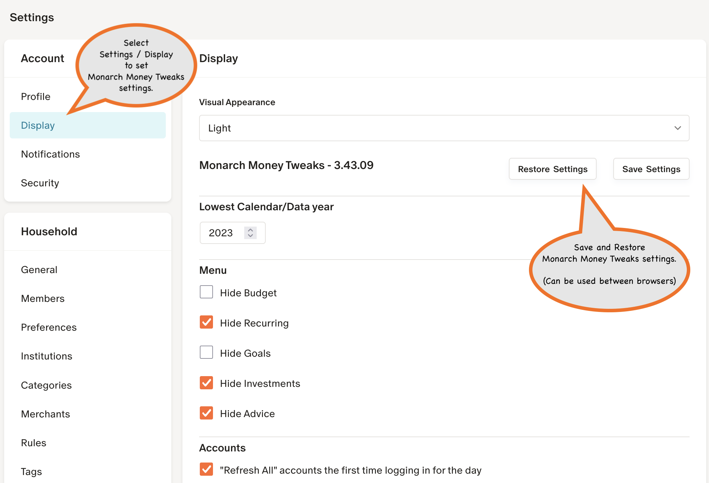

MM‑Tweaks adds UI, preferences, and report improvements inside the Monarch web app. Most settings live in Monarch’s Settings panel after installation.

---

### Fixed vs Flexible Spending (group level)

MM‑Tweaks classifies spending at the *group* level (MM‑Tweaks uses Group-level flags rather than Monarch’s internal Fixed/Flexible).  
To configure: **Settings → Categories** → mark groups Fixed or Flexible. These flags are used by Trends and Net Income reports.

 
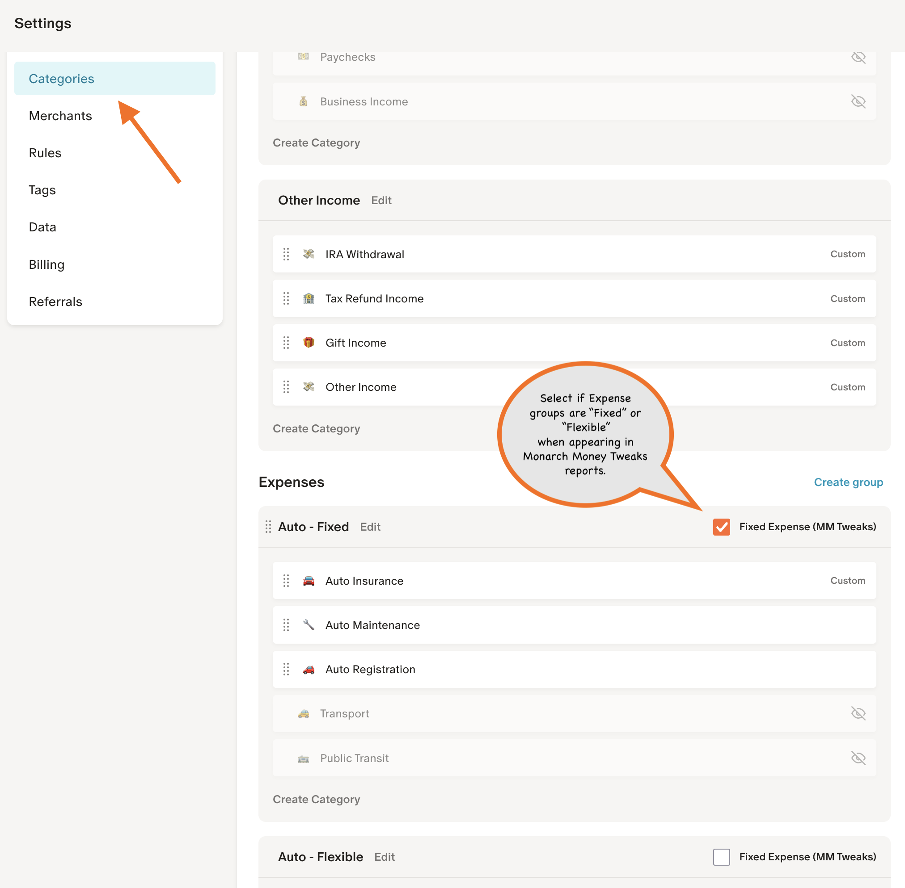

---

### Account Settings (per-account overrides)

Open **Reports → Accounts**, click **>** on an account, open the side panel `...` to access MM‑Tweaks account options.

 
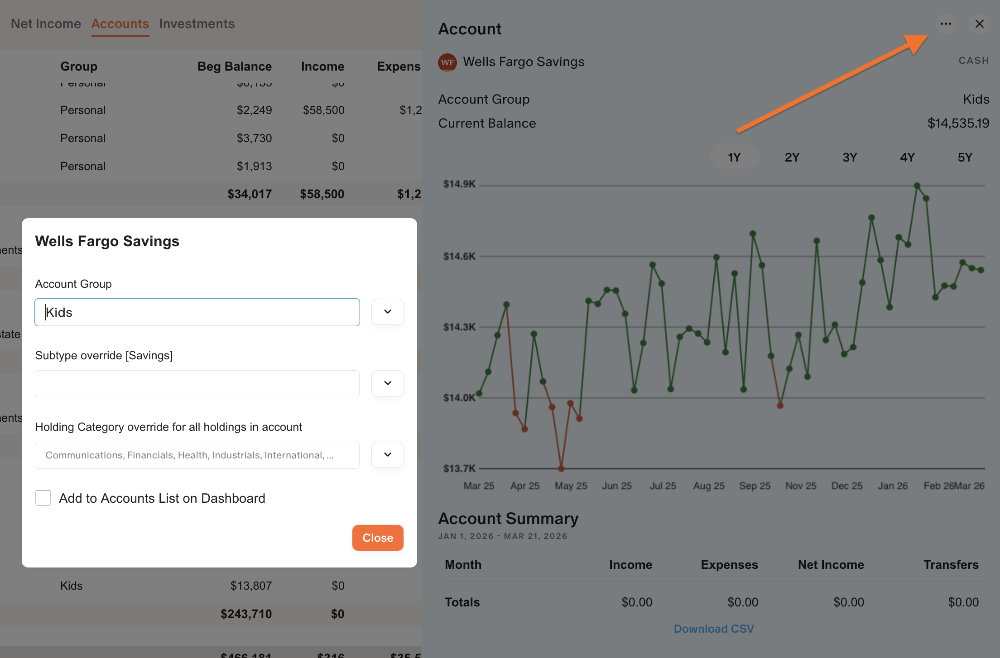

Key options:
- **Account Group** — group reports by any label you prefer (Personal, Business, Managed, Credit Cards, Trust, etc.). Useful examples:
  - Investments → `Managed` / `Non Managed` / `Tax Deferred`  
  - Credit cards → `Credit Cards`  
  - Property / vehicles → `Trust` / `Non Trust` / `Personal` / `John` / `Melonie` / `Kids`
- **Subtype override** — replace the account subtype shown in reports (ie: "Short Term Liability", "Long Term Liability", "Equities", "Bonds").
- **Holding Category override (account‑level)** — default holding category for all holdings in the account.
- **Add to Dashboard Accounts list** — include account summary on the Dashboard.

---

### Investment Holding Settings

Open **Reports → Investments**, select a holding and click `...` in the holding side panel for MM‑Tweaks options.

- **Holding Category override (ticker or account)** — assign a category (Sector, Asset Class, Bond Type, etc.) either per‑ticker or at the account level.

---

### Reports — Overview (Trends, Net Income, Accounts, Investments)

All four reports use the same flexible grid layout and share many features.

 
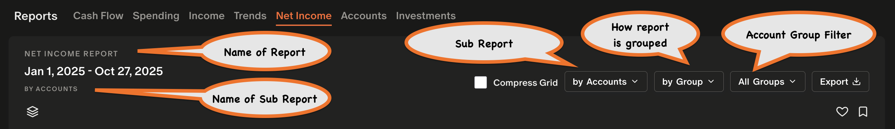

Highlights:
- **Sub Report**: view the report from different perspectives.  
- **Group By**: change how the report groups data (category, group, account, etc.).  
- Click any column header to sort ascending/descending.  
- **Account Group Filter** appears after you assign account groups.

#### Trends — Compare, Monthly & Yearly
 
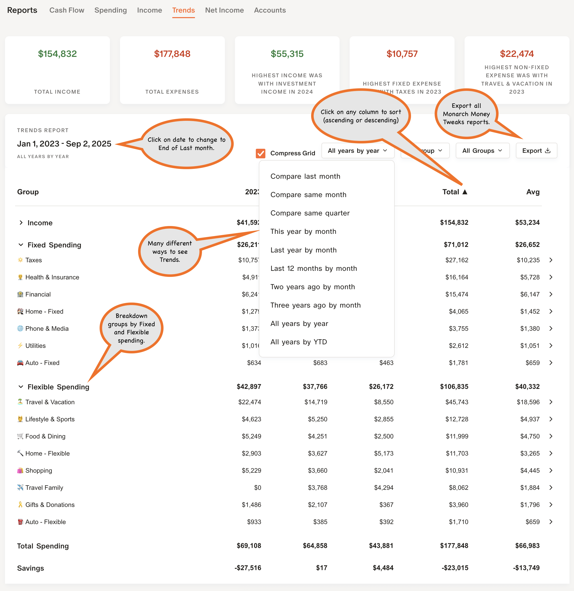

- Compare views, monthly/yearly rollups, and drilldowns into history are supported.
- History drilldowns show per‑month details and allow opening side‑panel details.

 
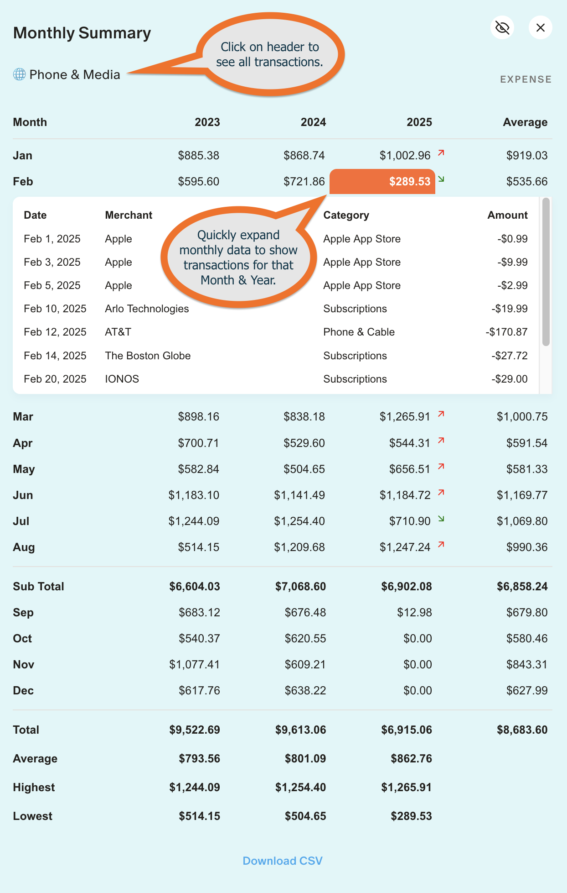

#### Net Income (Tags / Notes)
 

 

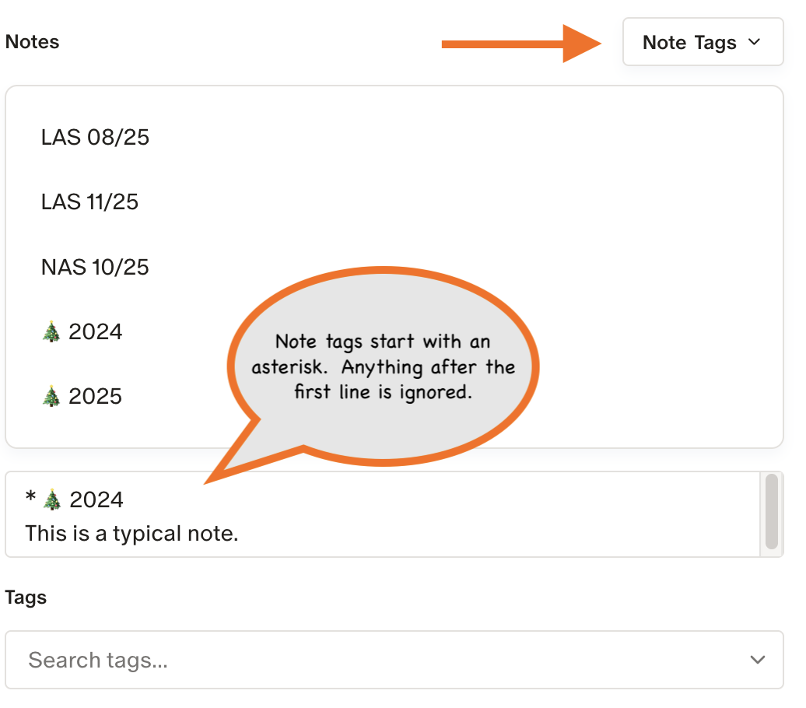

#### Accounts (Standard, Brokerage, Cash Statement, Personal Statement)
 
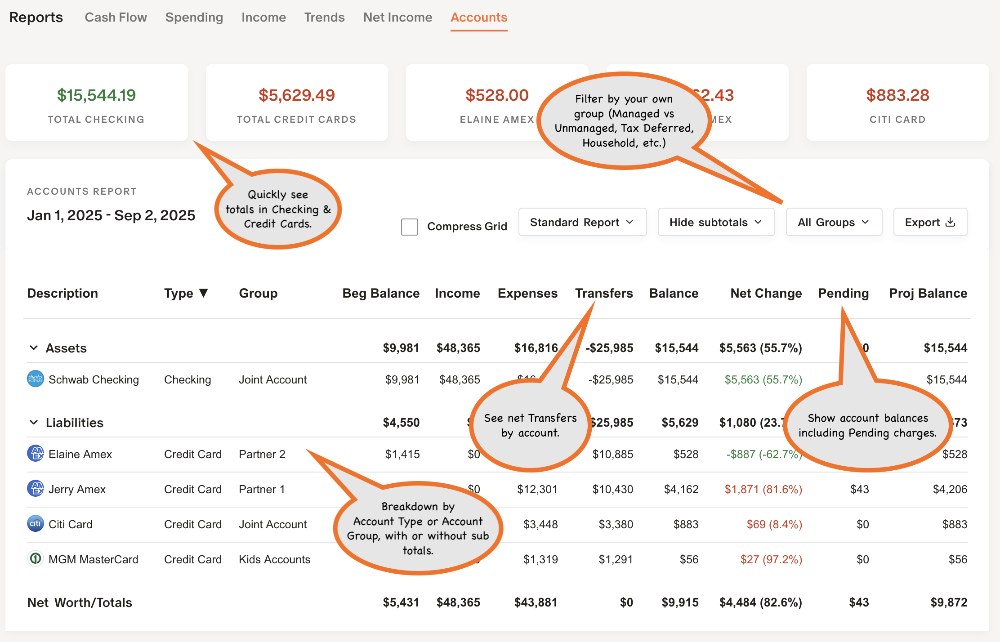
 
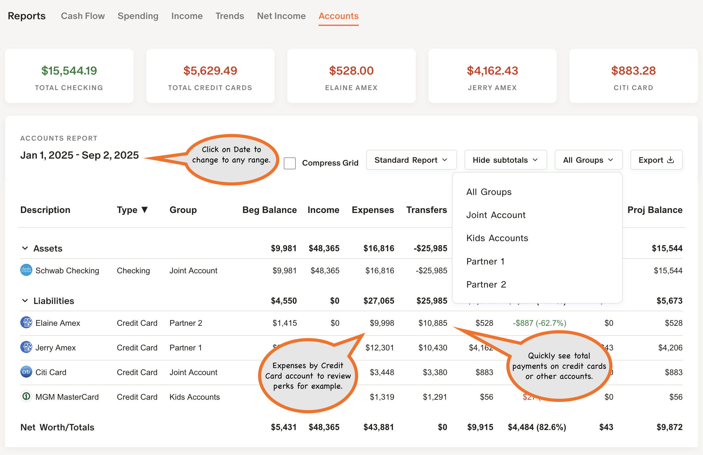

---

### Accounts — Overall Cash Statement (how cash is computed)
* Monarch returns an **Account Balance** at each snapshot.  
* Monarch returns the **Sum of all h_oldings** at each snapshot.
* MM-Tweaks calculates the _Idle Cash (cash uninvested) as **Account Balance - Sum of all holdings**.

If cash looks incorrect:
1. Verify no holdings are missing in the account.  
2. If the account contains crypto or manually added holdings, MM‑Tweaks may skip computing uninvested cash for that account.  
3. If everything looks correct but the amount still differs, contact Monarch support or reach out via repo discussion / email.

To show any holding as _Cash Holdings_ (SGOV, TIPS, SWTXX, etc.) select Accounts → select account → Holdings → click `>` next to the holding → set Type to **Cash**.

---

### Investments — reports, details and allocation

Portfolio, account, holding, and allocation views are supported.

 
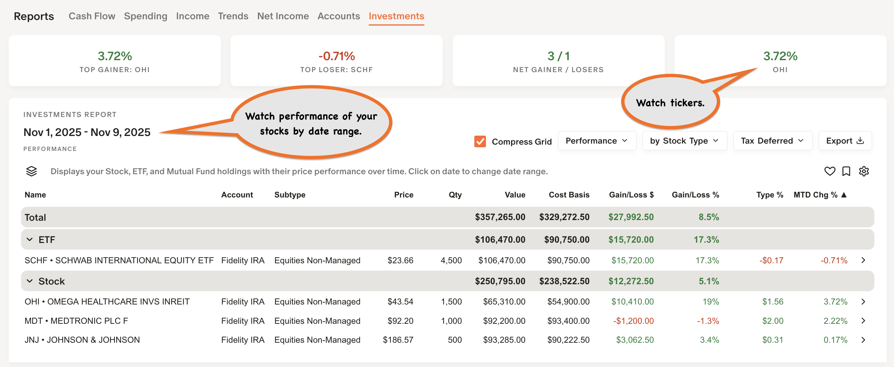
 
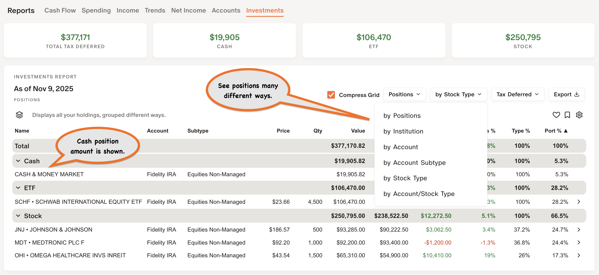

Detailed views:
 
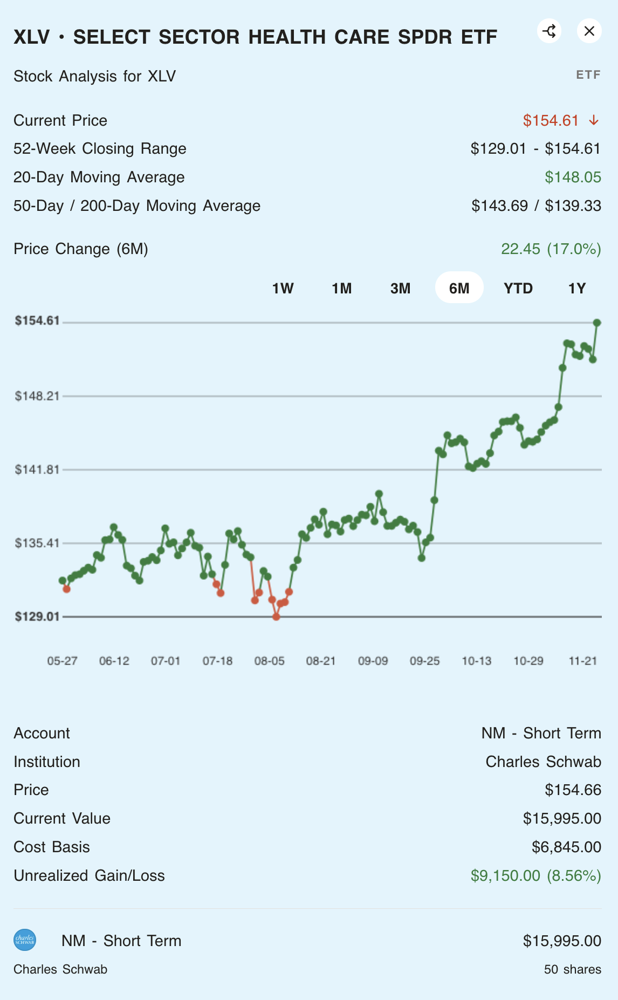

---
### Allocation targets and notes

Set targets for any account, holding type, or category by clicking the > on the Total row (top header) in the grid.

 
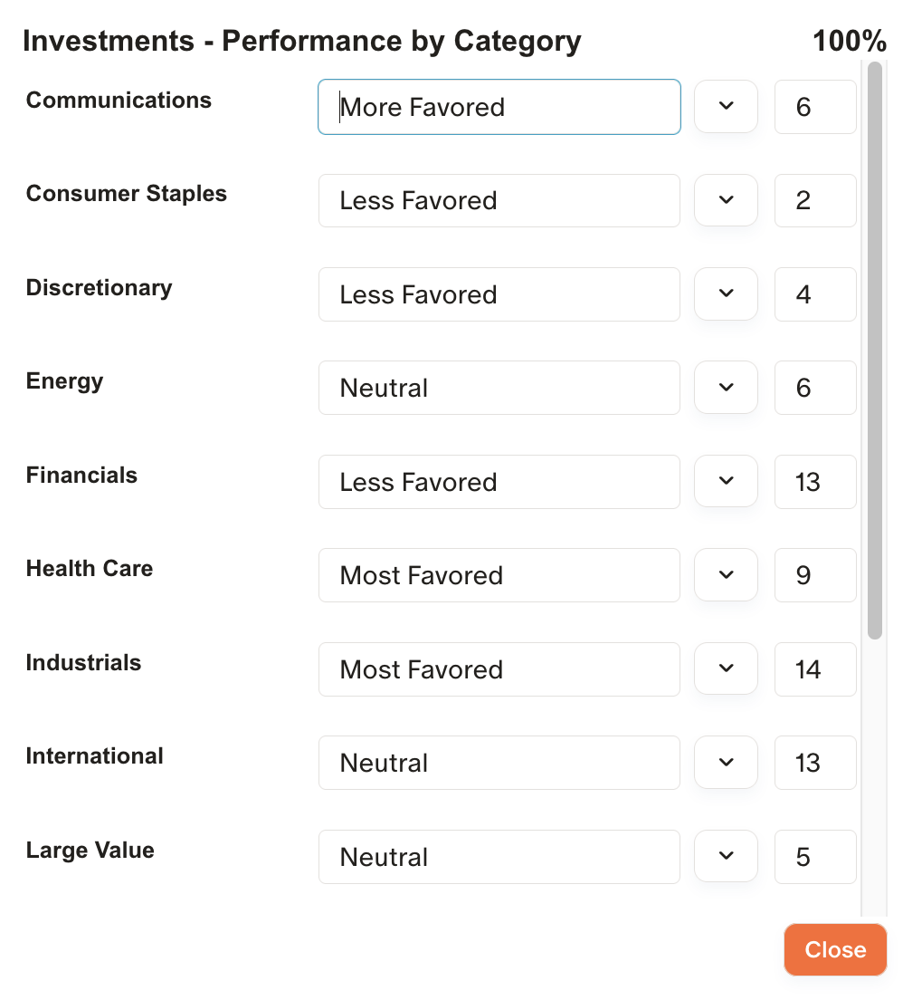

 

📌 When configuring allocation targets, set them at the appropriate levels so they behave consistently across portfolio and filtered/grouped views:

1. **Portfolio** → Allocation OR Performance (top-level portfolio view).  
2. **Institution** → by **Account** → by **Account Subtype** → by **Holding Type** → or by **Category** (choose the breakdown you need).  
3. **Account Group** (if you use Account Groups) — set targets per Account Group so filtered/grouped reports honor the group allocations.

 

Notes:
- Targets do **not** need to sum to 100% (e.g., set 70% Fixed Income and leave the remainder unspecified).  
- Verify targets in both Allocation and Performance views — behavior can differ depending on selected report and grouping.

---

### Examples & UI tips

- Personal Statement, multi‑cell tagging, and allocation examples:
 

 
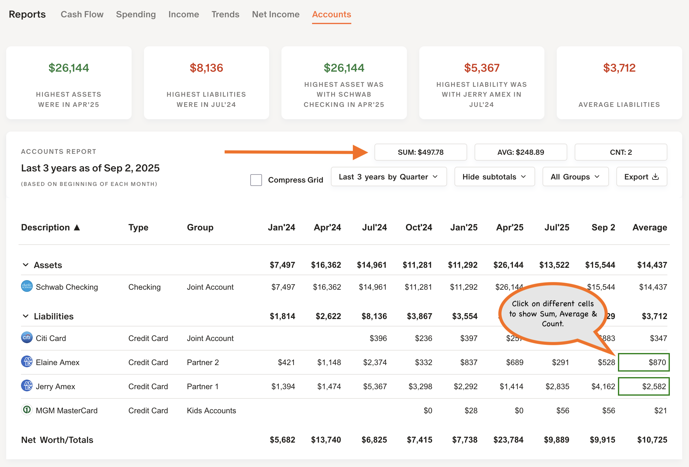

- Investments cards, holdings and allocation examples:
 

---

### Other MM‑Tweaks features

- Split transaction 50/50
 
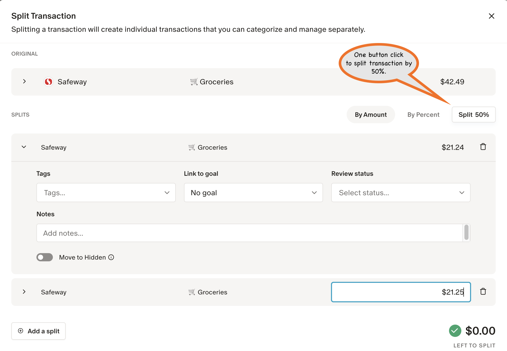

- Household breakdown on Accounts
 
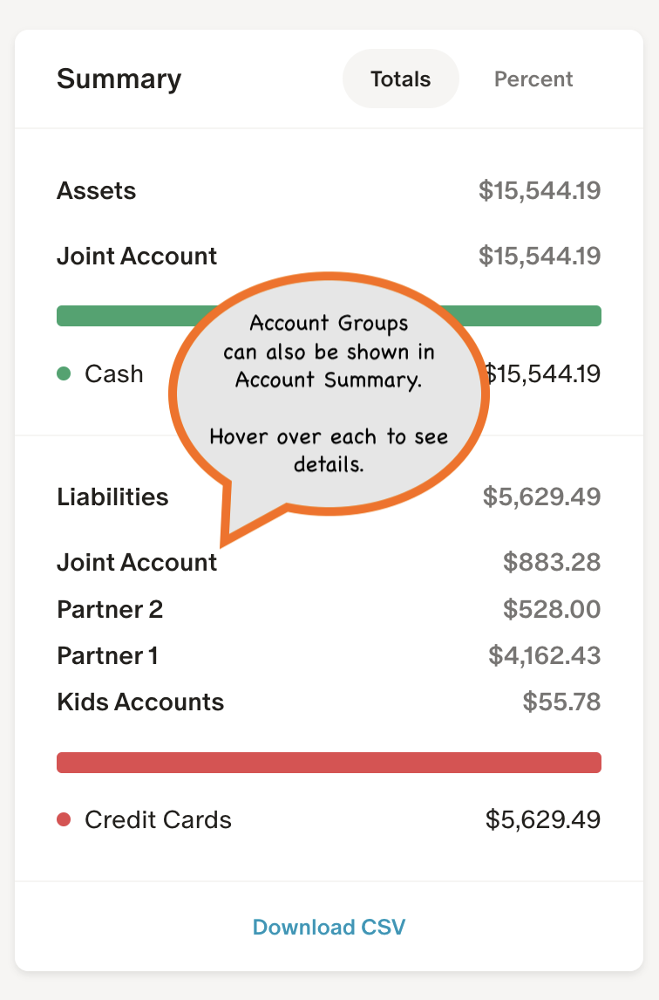

---
