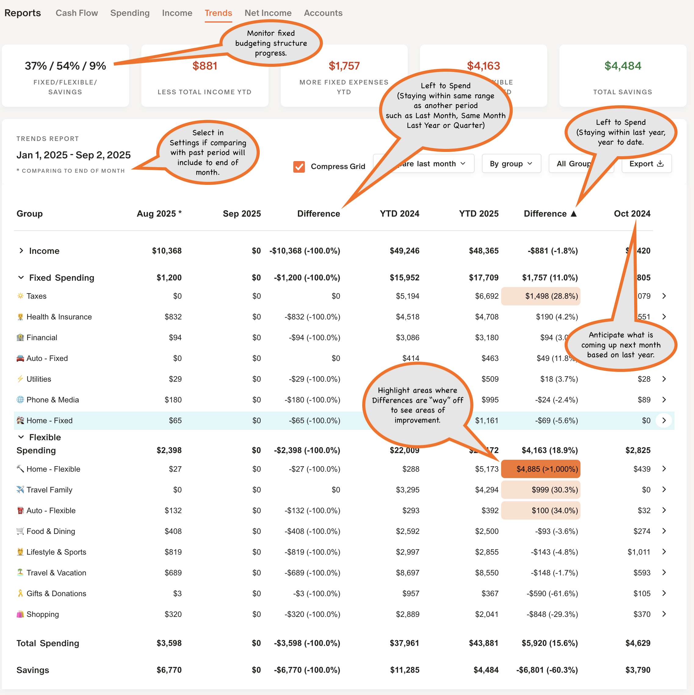
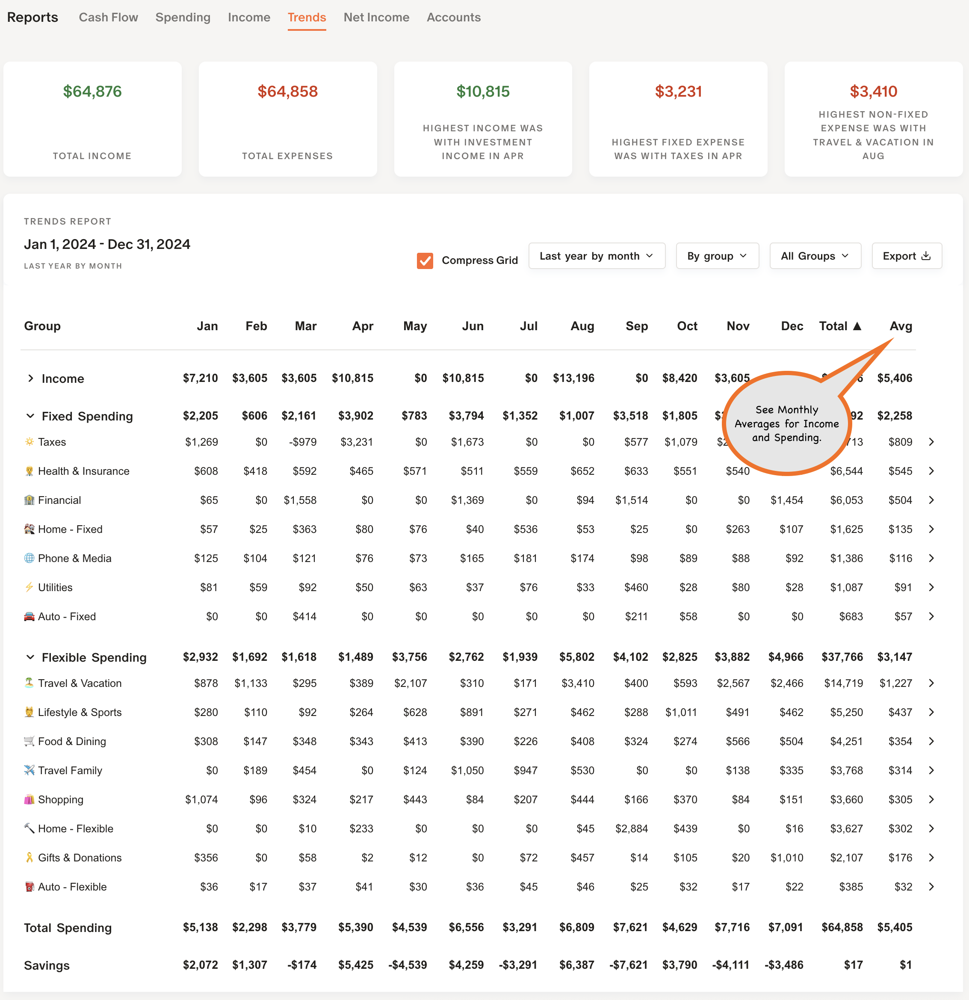
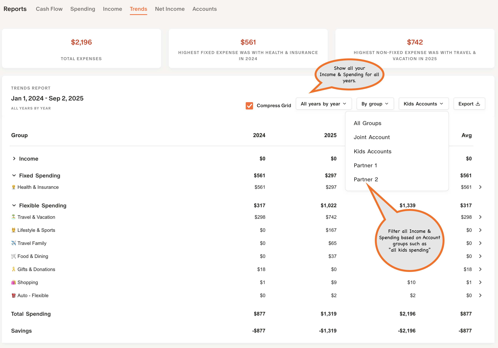

## 📚 Getting Started & Documentation

### Monarch Money Tweaks — Installation, License & Security

Install Monarch Money Tweaks from the [Extensions area](https://github.com/RobertParesi/Monarch-Money-Tweaks/blob/main/README.md) for your browser:  

Click here for detailed information on [License](https://github.com/RobertParesi/Monarch-Money-Tweaks/blob/main/LICENSE.md) and [Security](https://github.com/RobertParesi/Monarch-Money-Tweaks/blob/main/SECURITY.md). 

🧑‍💻 After installing, refresh the Monarch Money web app.  

⚙️ MM‑Tweaks settings are accessible inside the Monarch UI: click your name (lower-left) → **Settings**.

Quick start (recommended order):
1. Settings → Display — initial MM‑Tweaks options  
2. Settings → Categories — configure Fixed vs Flexible spending grouping  
3. Reports → Accounts → click **>** for each account to set Account Groups  
4. Explore Reports → Trends, Net Income, Accounts, Investments

---

### Monarch Money Tweaks — Settings

 

---

### Fixed vs Flexible Spending

MM‑Tweaks classifies spending at the *Group* level (not Monarch’s built‑in Fixed/Flexible). To set this:
- Go to **Settings → Categories** and mark groups as Fixed or Flexible.
- MM‑Tweaks uses those group flags in Trends and Net Income reports.

 

---

### Account Settings (Per‑account overrides)

Open **Reports → Accounts** and click **>** for an account, then the `...` in the side panel.

 

#### Account Group
Use account groups to organize reports by any label you want:
- Personal vs Business (e.g., `Personal`, `Business`)  
- Household members (`You`, `Partner`, `Kids`)  
- Tax treatment (`Taxed`, `Tax Deferred`)  
- Management (`Managed`, `Non Managed`)  
- Types (`Credit Cards`, `Retirement`, `Trust`, `Homes`, `Loans`)  

Examples (author preference):
- Investments → `Managed` / `Non Managed`  
- Credit cards → `Credit Cards`  
- Property / vehicles → `Trust` or `Non Trust`

#### Subtype override
Override the account subtype shown in reports (optional). Leave blank to use Monarch’s subtype.

#### Holding Category override (account‑level)
Set a default holding category applied to all holdings in the account (useful when all holdings share the same sector/type).

#### Add to Dashboard Accounts list
Enable to include this account’s summary on the Monarch Dashboard.

---

### Investment Holding Settings

Open **Reports → Investments**, select a holding and click the `...` in the holding side panel.

#### Holding Category override (ticker or account)
- Override a holding’s assigned type (Sector, Asset Class, Bond Type, etc.) at the holding or account level.
- Account-level override applies to all holdings without a ticker.

---

### Reports (Trends, Net Income, Accounts, Investments)

All four reports use the same flex‑grid layout.

 

Highlights:
- Use **Sub Report** to view different perspectives of the same data.
- Choose **Group By** to change grouping for the report.
- Click any column header to sort ascending/descending.
- After assigning Account Groups, the **Account Group Filter** appears.

#### Trends — Compare, Monthly & Yearly sub‑reports
 

#### Trends — Compare
 

#### Trends — Monthly
 

#### Trends — Yearly
 

#### Trends — History drill‑down
 

#### Net Income (Tags / Notes)
 

 

#### Accounts
 

 

---

### Accounts — Overall Cash Statement (How cash is computed)

Monarch provides both an *Account Balance* and *holdings* snapshot.  
Uninvested cash = Account Balance − sum(holdings value) at the snapshot.

If cash looks wrong:
1. Verify holdings are present in the account (missing holdings cause mismatch).  
2. If the account contains crypto or manual holdings, MM‑Tweaks may skip cash computation for that account (these can skew the balance).  
3. If data seems correct but numbers still differ, contact Monarch support or reach out via the repo discussion / email.

To make cash appear in Cash Holdings:
- Go to Accounts → select account → Holdings → click `>` next to holding → set Type to **Cash**.

---

#### Personal Statement (example)
 

#### Tag multiple cells (example)
 

---

### Investments — Reports & Details

Overview, detail, and allocation views:

 

 

#### Investment detail & holdings
 

 

---

📌 **When configuring allocation targets, set them at the following levels (all three where applicable):**

1. Portfolio → Allocation OR Performance (choose the appropriate top‑level view).  
2. Institution → by Account → by Account Subtype → by Holding Type → or by Category.  
3. Account Group (if you use Account Groups) — set targets at the Account Group level as needed.

This ensures targets apply correctly in the Reports → Investments Allocation and Performance views across portfolio, accounts, and grouped reports.

 

 

---

### Other MM‑Tweaks features

- Split Transaction 50/50
 

- Household breakdown on Accounts
 

---
