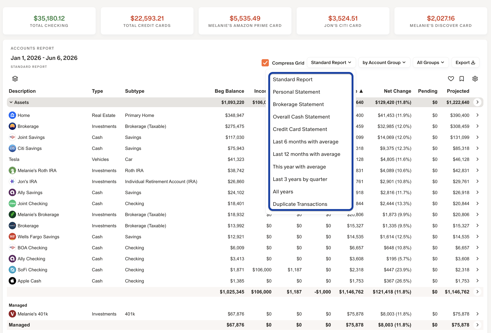
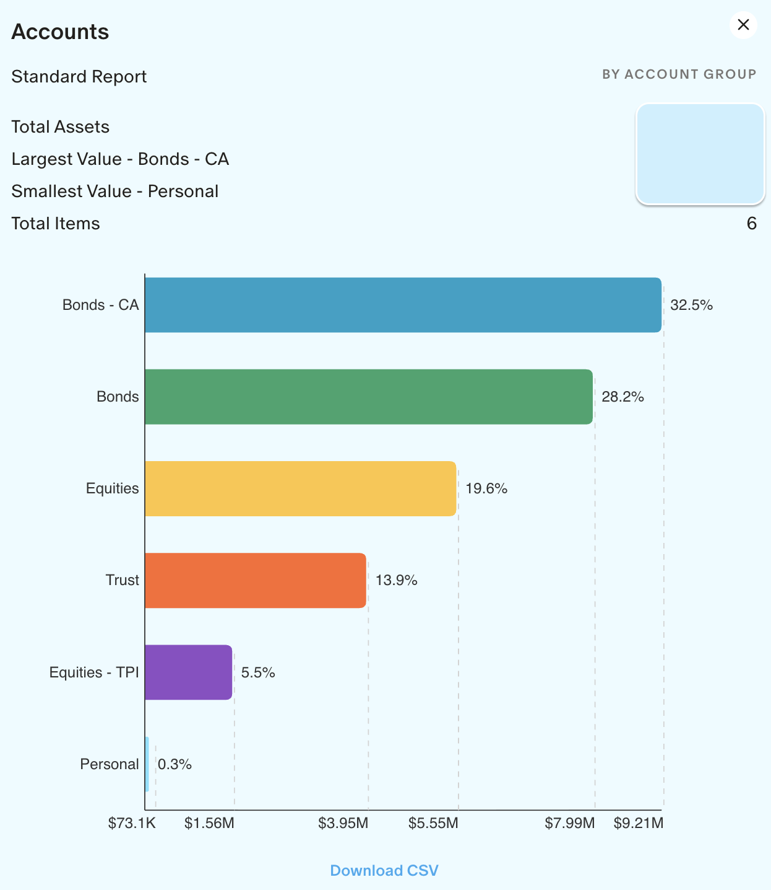
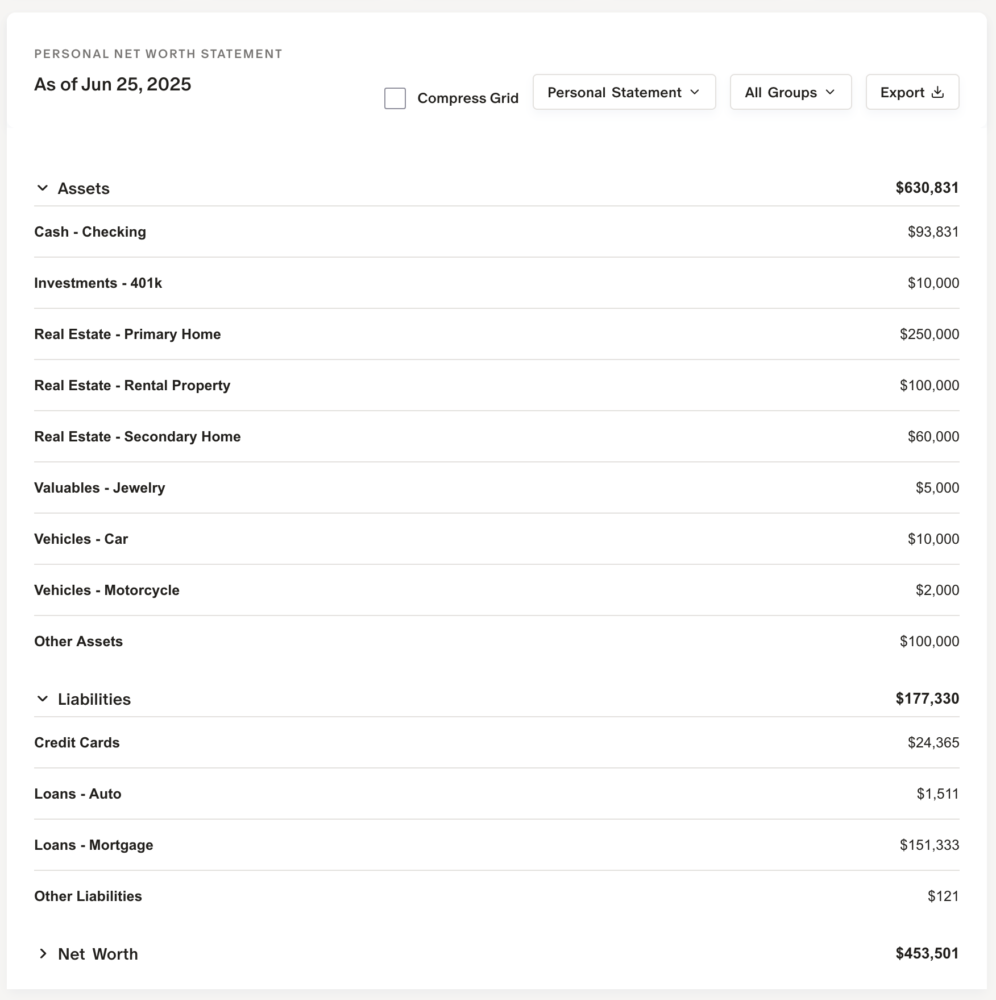
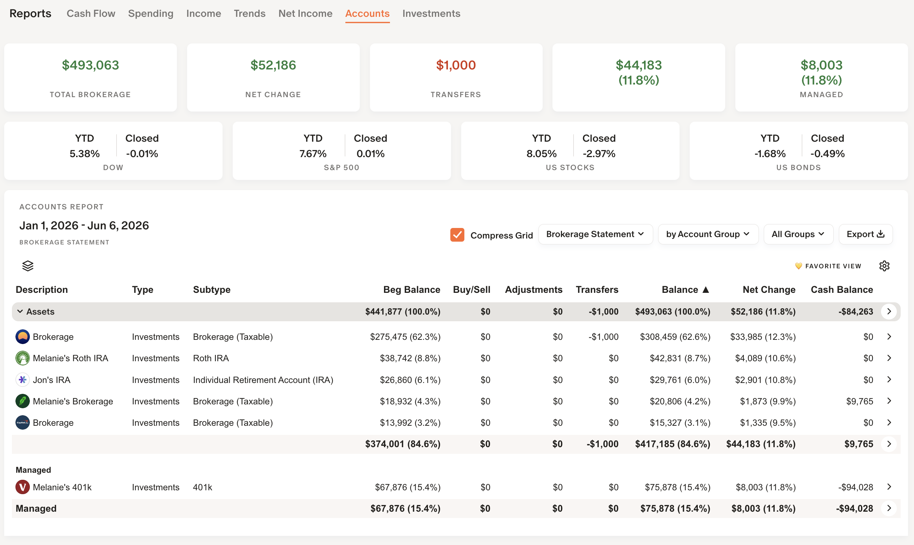
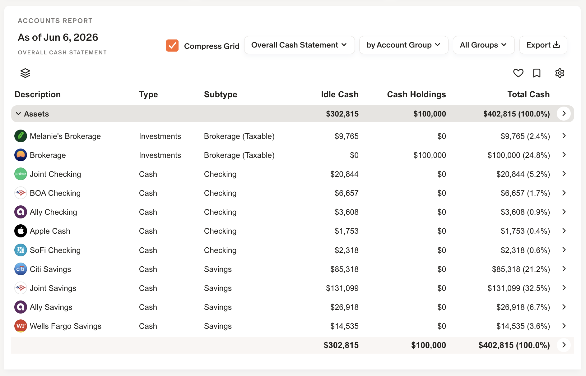
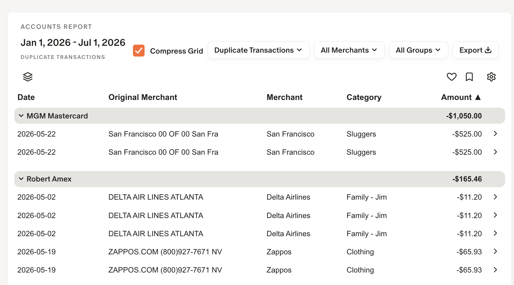
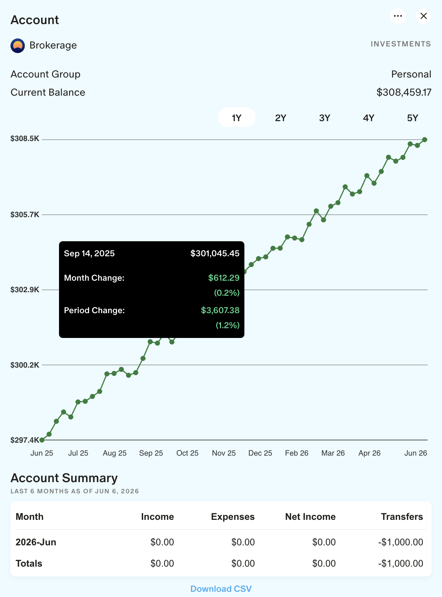
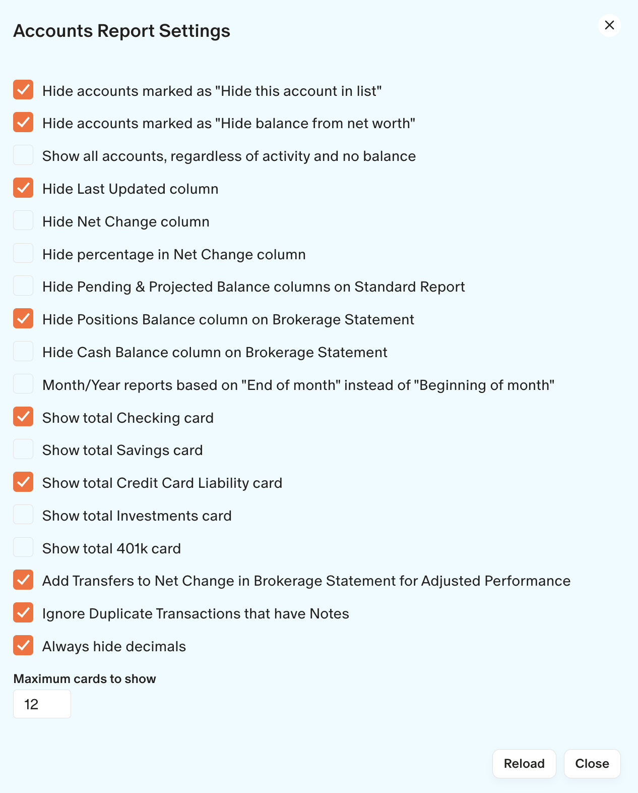

## 📚 Reports / Accounts

MM‑Tweaks can display your account balances in many different ways.

### Reports / Accounts (Standard Report)

This report will show all your accounts by Assets and Liabilities.  Use the Sub Report pull down to group the report many different ways.

 

 

---
### Reports / Accounts (Personal Statement)

This report will show a simple Balance Sheet of your Assets and Liabilities.  This report would be good to give to a loan-officer.

---

### Reports / Accounts (Brokerage Statement)

This report displays just your investment accounts.  

The Buy/Sell, Adjustments and Transfers columns come from transactions in the Transfer categories.  The Transfers column is any category from the Transfer group not labeled as Buy, Sell or Adjustment.  

If you want the Net Change column to exclude the Transfers (new money in and old money taken out), click on the ⚙️ for Settings and select **Add Transfers to Net Change in Brokerage Statement for Adjusted Performance**.

The **Positions** column is the total value of the holdings in the account.  The **Cash Balance** column is the current account balance minus the balance of the holdings (uninvested cash).  These two columns can be turned on and off in ⚙️ Settings.

---

### Reports / Accounts (Overall Cash Statement)

This report will show all cash in Checking, Savings and Investments as well as Uninvested Cash in brokerage accounts.

MM-Tweaks calculates the "uninvested cash" in brokerage accounts in the following manner:

* Monarch returns an **Account Balance** at each snapshot.  
* Monarch returns the **Sum of all holdings** at each snapshot.
* MM-Tweaks calculates the _Idle Cash_ (cash uninvested) as **Account Balance - Sum of all holdings**.

If cash looks incorrect:

1. Verify no holdings are missing in the account.  
2. If the account contains crypto or manually added holdings, MM‑Tweaks may skip computing uninvested cash for that account.  
3. If everything looks correct but the amount still differs, contact Monarch support or reach out via GitHub discussion here, Reddit community forum or by email.

To show any holding as _Cash Holdings_ (SGOV, TIPS, SWTXX, etc.) select Accounts → select account → Holdings → click `>` next to the holding → set Type to **Cash**.

---

### Reports / Accounts (Duplicate Transactions)

This report will find duplicate transactions based on Original Merchant or Merchant.  You can add a note to any transaction to remove it from the listing (See Settings)

---
### Reports / Accounts (Expanding Detail using >)

You can select the > on the Group or Account level for more details.

---

### Accounts Settings

Click on the ⚙️ for settings specific to Accounts.

