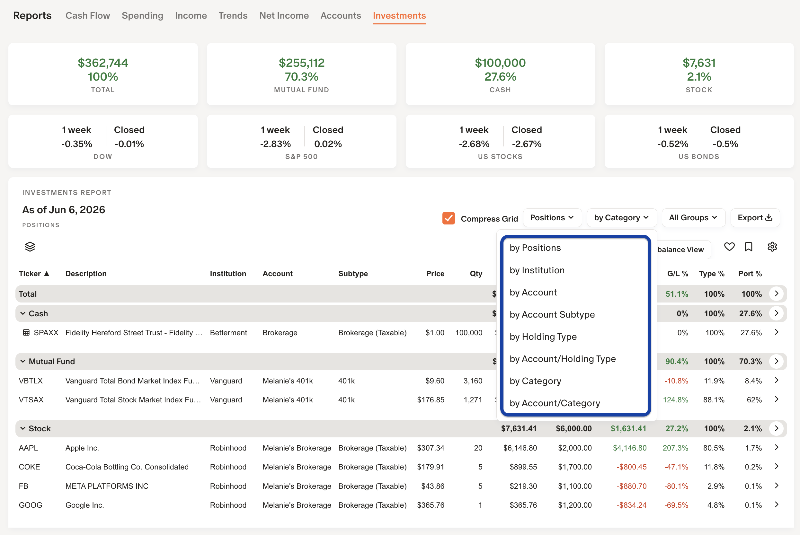
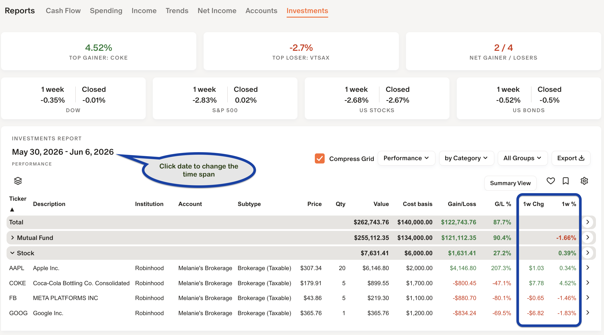
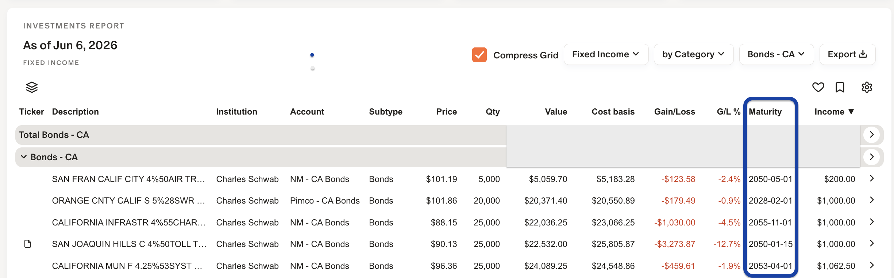
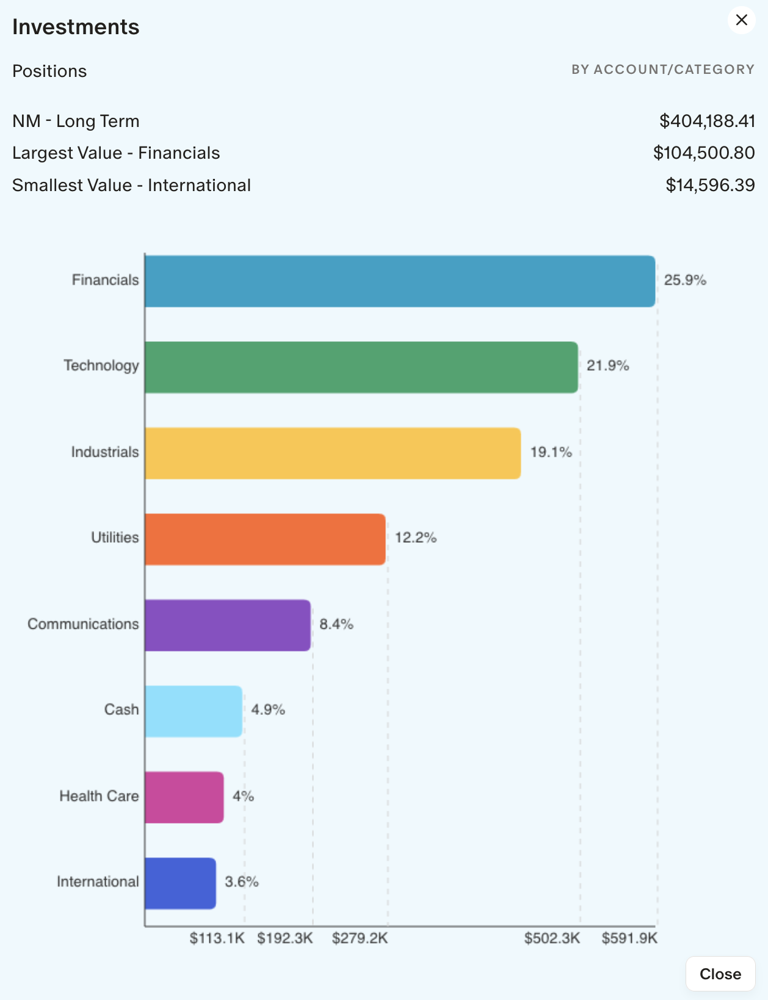
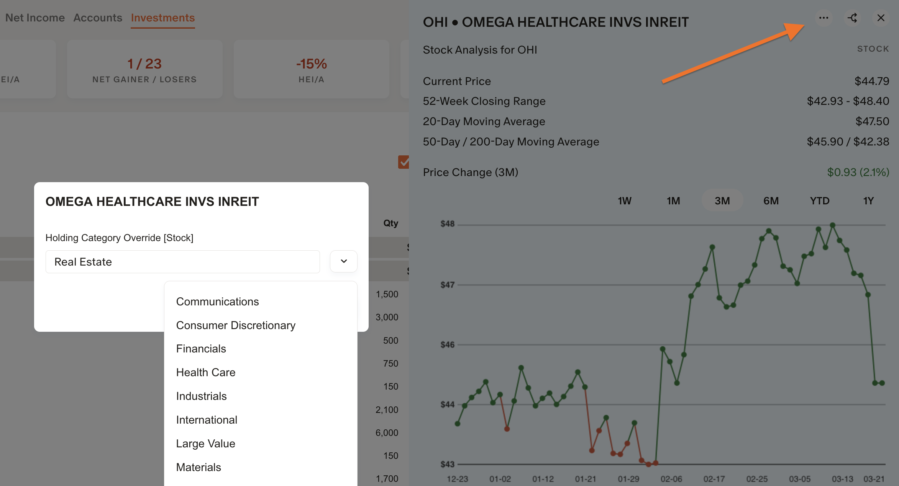
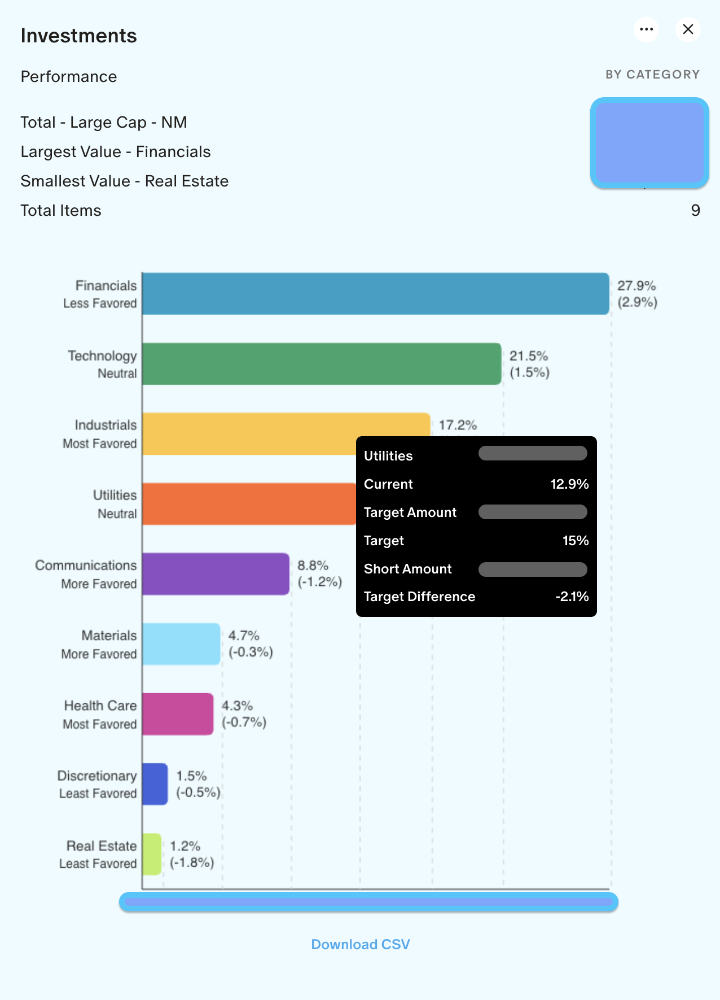
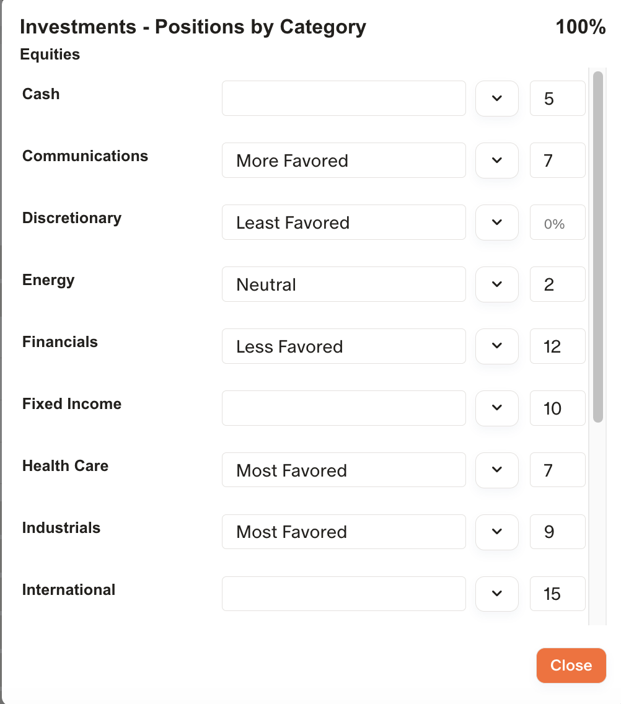
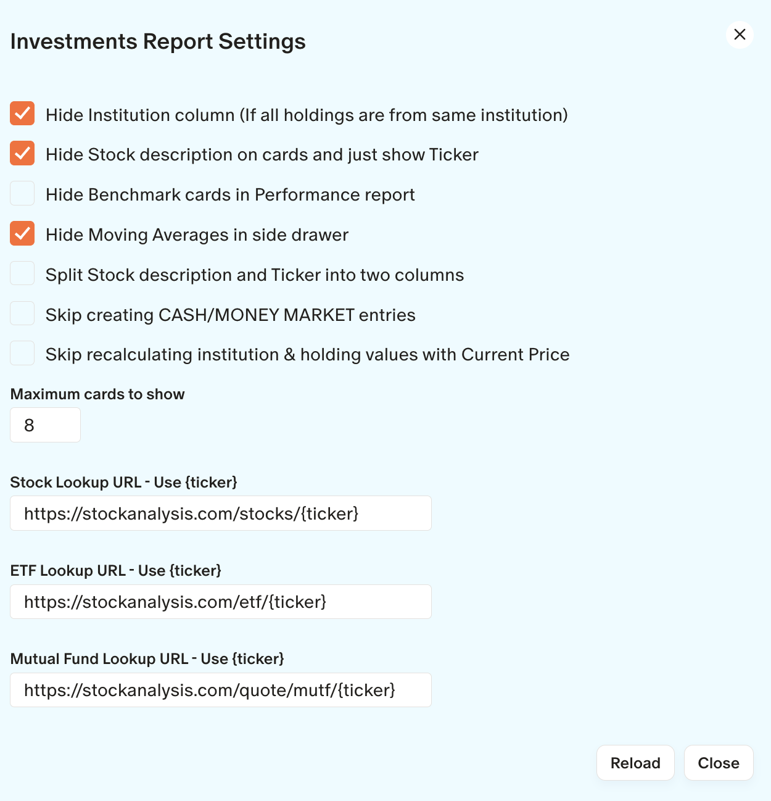

## 📚 Reports / Investments

There are four types of Investment reports:

1. **Positions** - Displays all your current holdings for each account. Use Allocation report to combine same holdings.
2. **Allocation** - Displays all your current holdings with same holdings combined. Use Portfolio report to split like holdings.
3. **Performance** - Displays all your equity holdings ignoring Fixed Income & Cash. Shows price performance over your selected time frame. Click on the date header to change the range (ie: Past Week, This Month, This Year, etc.)
4. **Fixed Income** - Displays all your fixed income (CD & Bond) holdings and trying to extract a maturity date and yearly income from the description.

### Positions and Allocations

Use these sub-reports to see a full portfolio and investment view.   Also use these views to set Allocation targets.  The full Gain / Loss will appear on the right.

---

### Performance

Use this sub-report to see how your equities have performed over any period of time.   It is important to know this is NOT based on when you purchased the stock and your cost basis.  The performance over time will appear on the right.

---

### Fixed Income

Use this sub-report to see how your Fixed Income holdings and their maturity dates.  The maturity dates are extracted from the text and are a best guess.

---
### How portfolio balances and holdings are computed

MM‑Tweaks consumes the portfolio query returned by Monarch and displays the holdings exactly as provided. If a holding is missing from the report, common reasons include: the institution did not return that holding, the holding is not a public/security holding, or it’s an account type (e.g., 529) treated differently by the data feed.

When holdings are present, MM‑Tweaks creates a CASH / MONEY‑MARKET line equal to: Account Balance − sum(holdings value). If an account has no holdings at all, MM‑Tweaks shows a single “(BALANCE ONLY)” entry for that account.  The creation of these entries can be disabled in ⚙️ Settings.

Important: MM‑Tweaks reports are driven entirely by the holding data returned from Monarch’s API. The extension cannot invent, modify, or add holdings that the source does not provide. If it a public holding and should appear, contact Monarch support.

---
### Stock Charts and Allocation Bar Charts

Click on the **>** in the far right of any investment holding for a Detailed view:

Click on the **>** in the far right of any Total or Group for a Summary or Allocation view:

### Investment Holding Settings

Select **Reports → Investments**, click on **>** (far right) of any equity holding and click `...` in the holding side panel for MM‑Tweaks options.

- **Holding Category override (ticker or account)** — assign a category (Sector, Asset Class, your objective, Index Strategy, Bond Type, etc.) either per‑ticker or at the account level.  In my examples below, I use a **sector**.

- If you assign a Category override for all holdings, any uncategorized or new tickers will show up in the “Stock” category—making it easy to spot misses and newly added stocks.

---
### Allocation targets and notes

Set targets by institution, account, holding type, or category by clicking the > on the Total row (top header) of the grid and then [...] in top-right.

 

 

📌 When configuring allocation targets, they are set at the following 2 levels.  Positions & Allocation use the same target information.
 
1. By Institution / Account / Account subtype / Holding type / Category (choose the breakdown you need).  
2. By all Accounts or by Account Group. 

Notes:
- Targets do **not** need to sum to 100% (e.g., set 70% Fixed Income and leave the remainder unspecified).  
- Targets can only be set in Positions & Allocation. Performance and Fixed‑Income views don’t show every holding (nor uninvested cash), so they’re not reliable bases for portfolio‑level targets.

---

### Investments Settings

Click on the ⚙️ for settings specific to Investments.

