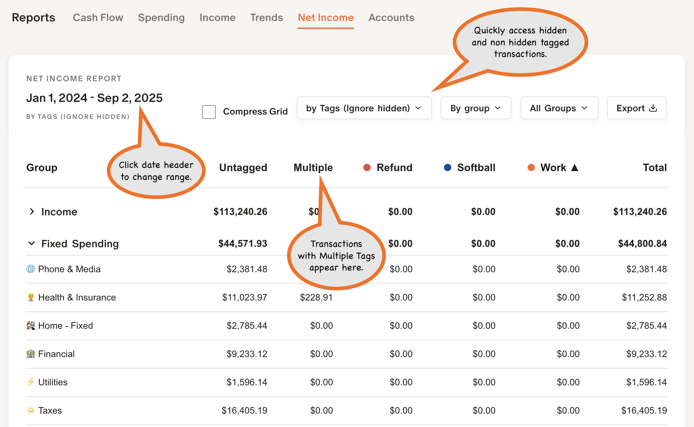
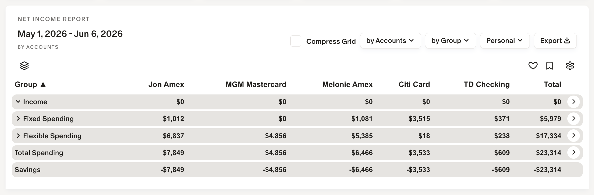

## 📚 Reports / Net Income 
### by Tags, by Notes, by Account, by Owner

MM‑Tweaks will summarize your Income and Expenses in other ways such as by Tags, Account, Notes and Owner.   

Summary by **Tags** shows both tagged and untagged transactins.  If a transaction has multiple tags, it will show up in the **Multiple** column.

---

Summary for **Notes** finds any transaction which has a note that starts with *<space> such as "* Vacation".   This allows you to use free-form tags without having to designate and use one of the Monarch tags.   If you have additionals to add just place it on the next line.

---

Summary for **Accounts** allows you to see Income and Expenses by Account.  This would be good to see spending by credit card for points or balance spending by account.

---

### Net Income Settings

Click on the ⚙️ for settings specific to Net Income.

