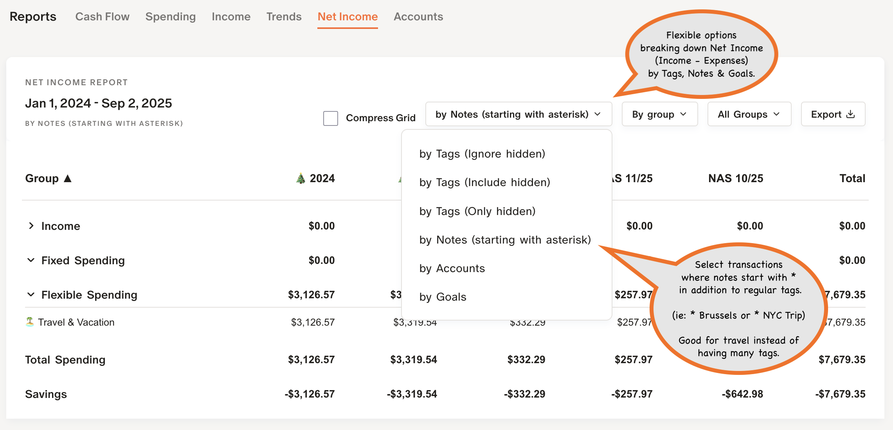
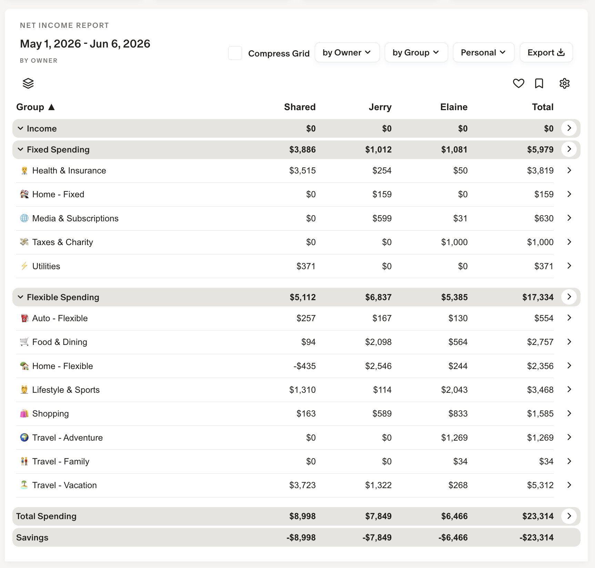
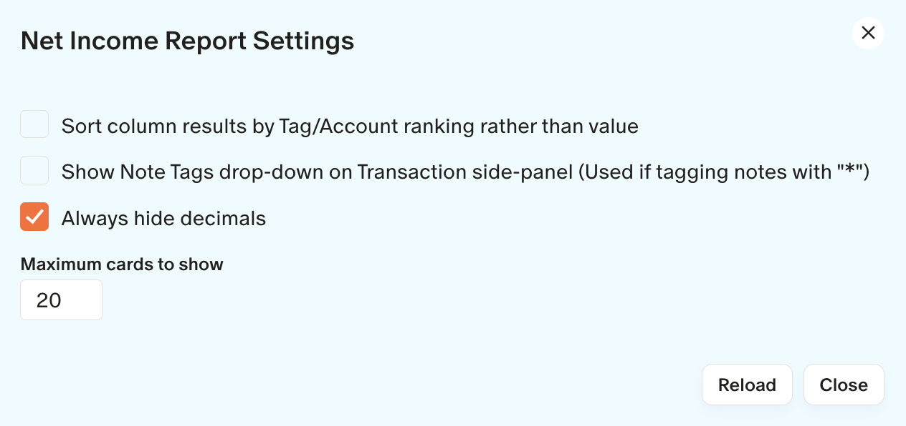

## 📚 Reports / Net Income 
### by Tags, by Notes, by Account, by Owner

In addition to Trends summaries, MM‑Tweaks also breaks down your income and expenses by Tags, Account, Notes, and Owner for flexible reporting.

Summary by **Tags** shows both tagged and untagged transactions.  If a transaction has multiple tags, it will show up in the **Multiple** column.

---

Summary for **Notes** finds any transaction which has a note that starts with *<space> such as "* Vacation".   This allows you to use free-form tags without having to designate and use one of the Monarch tags.   If you have additional notes to add just place it on the next line.

---

Summary for **Accounts** allows you to see Income and Expenses by Account.  This would be good to see spending by credit card for points or balance spending by account.

---

Summary for **Owner** allows you to see Income and Expenses either Shared or assigned to an owner.  This would be good to see shared and partner spending. 

---
### Net Income Settings

Click on the ⚙️ for settings specific to Net Income.

