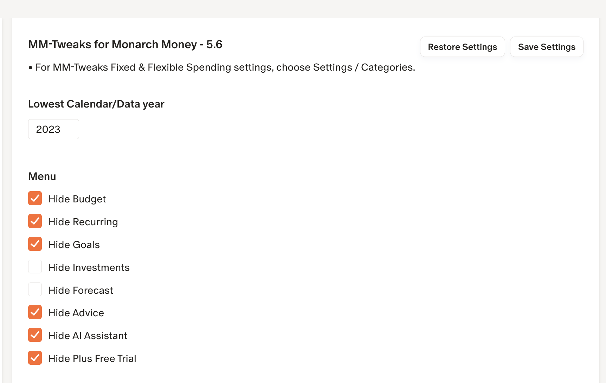
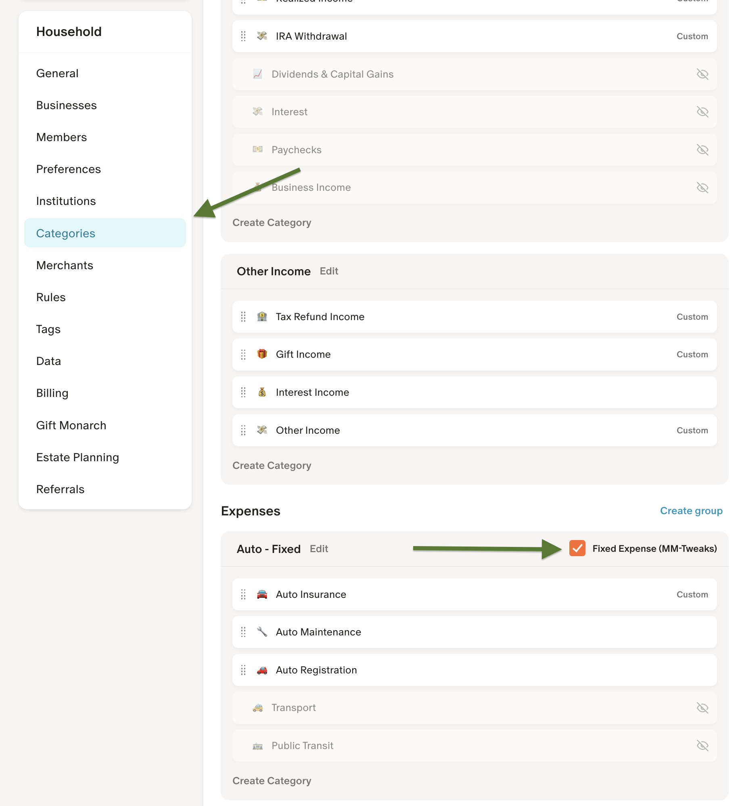
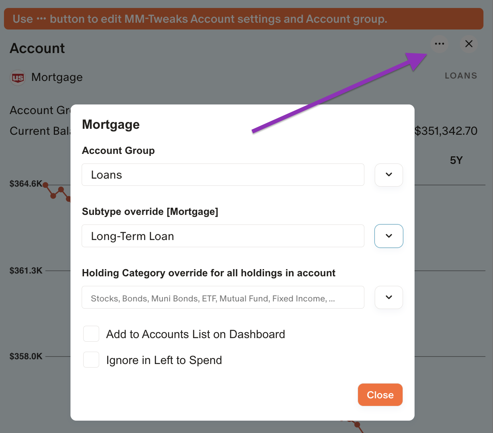
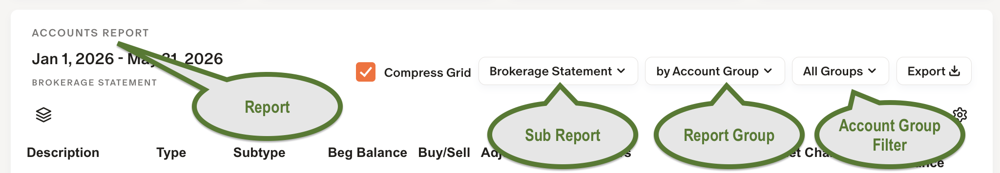

## 📚 Getting Started & Documentation

### Monarch Money Tweaks — Installation, License & Security

Install Monarch Money Tweaks from the [Extensions area](https://github.com/RobertParesi/Monarch-Money-Tweaks/blob/main/README.md) for your browser:  

Click here for detailed information on [License](https://github.com/RobertParesi/Monarch-Money-Tweaks/blob/main/LICENSE.md) and [Security](https://github.com/RobertParesi/Monarch-Money-Tweaks/blob/main/SECURITY.md). 

🧑‍💻 After installing, refresh the Monarch Money web app.  

⚙️ MM‑Tweaks settings are accessible inside the Monarch UI: click your name (lower-left) → **Settings**.

Recommended initial steps (details below):

1. Settings → Display — initial MM‑Tweaks options  
2. Settings → Categories — configure Fixed vs Flexible spending (group level)  
3. Reports → Accounts → click **>** for each account to set Account Groups  
4. Explore Reports → Trends, Net Income, Accounts, Investments

---

### MM‑Tweaks — Settings (overview)

MM‑Tweaks adds UI, preferences, and report improvements inside the Monarch web app. Most settings live in Monarch’s Settings panel after installation.  

Click on **Settings** in lower-left of Monarch Money web app and then **Display**.
 

---

### Fixed vs Flexible Spending (group level)

MM‑Tweaks classifies spending at the *group* level (MM‑Tweaks uses Group-level flags rather than Monarch’s internal Fixed/Flexible).  

To configure: **Settings → Categories** → mark groups Fixed or Flexible. These flags are used by Trends and Net Income reports.  One reason is Monarch uses three category levels; the third level is intended for budgeting, not for pacing/actuals. 

If you need to, simply split those categories into two groups—for example, "Auto - Fixed", "Auto - Flexible", “Home — Fixed” and “Home — Flexible.”

---

### Use Reports / Accounts for special MM-Tweaks Account Settings

Select **Reports → Accounts**, click **>** (far right) on an account to open the side panel, then `...` to access MM‑Tweaks account options.

 

Key options:
- **Account Group** — group reports by any label you prefer (Personal, Business, Managed, Credit Cards, Trust, etc.). Useful examples:
  - Investments → `Managed` / `Non Managed` / `Tax Deferred`  
  - Credit cards → `Credit Cards`  
  - Property / vehicles → `Trust` / `Non Trust` / `Personal` / `Jerry` / `Elaine` / `Kids`
- **Subtype override** — replace the account subtype shown in reports (ie: "Short Term Liability", "Long Term Liability", "Equities", "Bonds").
- **Holding Category override (account‑level)** — default holding category for all holdings in the account.
- **Add to Dashboard Accounts list** — include account summary on the Dashboard.
- **Ignore in Left to Spend** — exclude this account in the Budget / Left to Spend from being included.

---

### Overview Reports — Trends, Net Income, Accounts, Investments

Monarch Money Tweaks focuses on four enhanced reports: Trends, Net Income, Accounts, and Investments.  All four reports use the same flexible grid layout and share many features.
 

Highlights:
- **Sub Report**: view the report from different perspectives.  
- **Report Grouping**: change how the report groups data (category, group, account, etc.).  
- **Account Group Filter** appears after you assign account groups.
- Click any column header to sort ascending/descending.
- Click any date header to change date or in Trends change to end of previous month.
