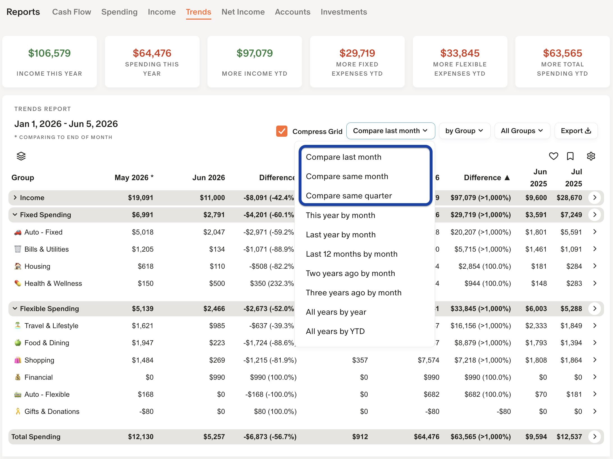
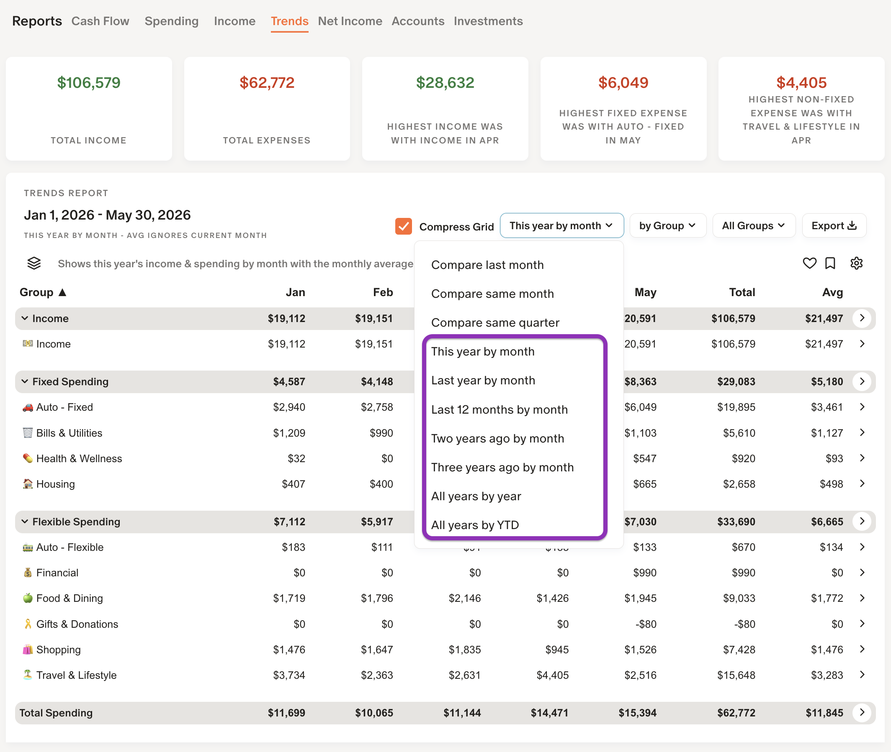

## 📚 Reports / Trends

💬 If you have not already setup Fixed & Flexible spending for MM-Tweaks, please see the Getting Started document first.

MM‑Tweaks derives Trends from transactions and transaction history only — it does not use any Budget, Goals, or Recurring data. For me personally, I prefer this simpler workflow: use transactions as the single source of truth so I don’t have to maintain other data in Monarch. Think of Trends as a practical alternative to traditional budgeting: it builds budget guidance from actual transaction trends (last month, same month last year, same quarter, etc.).

### Trends Compare reports

The first three columns are designed by selecting a "Compare ..." Sub Report:

* **Compare last month** — Column 1 shows last month’s total, Column 2 shows this month’s total, and Column 3 shows the difference. Recommended only for brand‑new Monarch users without historical data.  

* **Compare same month** — Column 1 shows the total for the same month last year, Column 2 shows this month’s total, and Column 3 shows the difference. This is the usual preferred view.  

* **Compare same quarter** — Column 1 shows the total for the same quarter last year, Column 2 shows this quarter’s total, and Column 3 shows the difference. Good choice for retirees, those making estimated IRS payments, or anyone tracking spending on a quarterly basis.

📌 **“Always compare to End of Month” option**
When enabled, comparisons use full month totals for the prior period rather than truncating at today’s date. Normally both columns show values up to today (e.g., on March 16 both Column 1 and Column 2 reflect data through March 16). Turn on this setting (⚙️) to make Column 1 represent the full prior month (e.g., March 1–31) so you’re comparing this partial month to a complete month. I prefer having this option on for a clearer month‑to‑month view without surprises.

Columns 4–6 show year‑to‑date comparisons: this year vs. last year and the difference. This is your pacing view — an easy way to track whether you’re on track without using Monarch’s budget features. I recommend separating Fixed vs. Flexible categories: Fixed spending tends to be steady, while Flexible spending swings more (vacations, seasonal purchases) and can shift between months.

Shading highlights the rows that need attention — focus only on shaded lines. Three levels indicate degree of deviation: >25%, >50%, and >100%.

🔮 **Upcoming expenses**
The final two columns are optional (toggle in Settings: “Hide future month columns — Remaining ‘this month’ & next month”).  

The first of these shows last year’s expenses from tomorrow through the end of the month.
(Example: on March 16, 2026 it displays what happened from March 17–31, 2025.)

The second shows the total for the entire next month from last year.
Use them to compare expected remaining spend against the same period from the prior year.

### Trends History reports

### Trends Details

Click the **>** on the far right for history drill‑downs, month‑by‑month details, and the Month/Step charts.

